#  Lab9 - MLOps Pipeline con Apache Airflow

[](https://airflow.apache.org/)
[](https://www.python.org/)
[](https://www.docker.com/)
[](https://scikit-learn.org/)

##  Descripción del Proyecto

Sistema de pipeline MLOps automatizado para predicción de contratación usando Apache Airflow. El proyecto implementa dos enfoques arquitectónicos (lineal y dinámico) para entrenar múltiples modelos de Machine Learning y desplegarlos mediante una interfaz web interactiva.

###  Objetivos Principales

- **Automatización**: Pipeline completo de ML usando Apache Airflow
- **Escalabilidad**: Comparación entre ejecución secuencial vs paralela
- **Productivización**: Interfaz web para predicciones en tiempo real
- **Robustez**: Manejo de errores y recuperación automática

##  Arquitectura del Sistema

```mermaid
graph TD
    A[Datos de Entrada] --> B[DAG Lineal]
    A --> C[DAG Dinámico]
    B --> D[Entrenamiento Secuencial]
    C --> E[Entrenamiento Paralelo]
    D --> F[Selección Mejor Modelo]
    E --> F
    F --> G[Gradio Interface]
    G --> H[Predicción Usuario]
```



###  Componentes del Pipeline

1. **Ingesta de Datos**: Carga y validación automática
2. **Preprocesamiento**: Limpieza y transformación de features
3. **Entrenamiento**: Múltiples algoritmos ML (RandomForest, SVM, LogisticRegression)
4. **Evaluación**: Métricas de rendimiento y selección de mejor modelo
5. **Despliegue**: Serialización y disponibilidad del modelo
6. **Interfaz**: Web UI para predicciones interactivas

##  Estructura del Proyecto

```
Lab9/
├──  dags/                        # Definiciones de DAGs
│   ├── dag_lineal.py              # Pipeline secuencial
│   ├── dag_dynamic.py             # Pipeline paralelo
│   ├── hiring_functions.py        # Funciones para DAG lineal
│   └── hiring_dynamic_functions.py # Funciones para DAG dinámico
├──  2025-11-04/                 # Resultados de ejecución
│   └── models/                    # Modelos entrenados
├── docker-compose.yaml            # Configuración Docker
├── requirements.txt               # Dependencias Python
├── train_models.py               # Script entrenamiento standalone
├── gradio_robust.py              # Interfaz web robusta
├── vale_data.json                # Datos de prueba
└── README.md                     # Este archivo
```

##  Instalación y Configuración

### Prerrequisitos

- **Docker** y **Docker Compose** instalados
- **Puerto 8080** disponible para Airflow UI
- **Puerto 7861** disponibles para Gradio

### Instalación Rápida

```bash
# . Iniciar servicios
docker compose up -d --build

# 2. Esperar inicialización (2-3 minutos)
# Verificar logs si es necesario
docker compose logs -f airflow
```

###  Verificación de Instalación

```bash
# Verificar contenedores activos
docker compose ps

# Verificar logs de Airflow
docker compose logs airflow | tail -20

# Acceder a Airflow UI
# http://localhost:8080 (admin/admin)
```

## 🎮 Uso del Sistema

### 1.  Airflow Dashboard

1. **Acceder**: [http://localhost:8080](http://localhost:8080)
2. **Credenciales**: `admin` / `admin`
3. **Activar DAGs**: Hacer toggle en `dag_lineal` y `dag_dynamic`
4. **Ejecutar**: Click en "Trigger DAG" o esperar programación automática

### 2. Monitoreo de Ejecución

- **Graph View**: Visualizar dependencias y estados
- **Tree View**: Historial de ejecuciones
- **Gantt View**: Análisis de tiempos de ejecución
- **Task Duration**: Métricas de rendimiento

### 3. Interfaz de Predicción

```bash
# Iniciar Gradio (opcional - ya incluido en pipeline)
docker exec -it <container-id> python /opt/airflow/gradio_robust.py

# Acceder a la interfaz
# http://localhost:7861
```

##  Análisis Comparativo

### DAG Lineal vs DAG Dinámico

| Aspecto | DAG Lineal | DAG Dinámico |
|---------|------------|---------------|
| **Ejecución** | Secuencial | Paralela |
| **Tiempo Total** | ~5-8 minutos | ~3-5 minutos |
| **Uso de Recursos** | Bajo | Alto |
| **Complejidad** | Simple | Avanzada |
| **Escalabilidad** | Limitada | Excelente |

### Rendimiento de Modelos

```python
# Resultados típicos del entrenamiento
Modelos_Performance = {
    'RandomForest': {'accuracy': 0.9167, 'tiempo': '45s'},
    'SVM': {'accuracy': 0.8633, 'tiempo': '32s'},
    'LogisticRegression': {'accuracy': 0.9033, 'tiempo': '12s'}
}
```

##  Configuración Avanzada

### Variables de Entorno

```yaml
# docker-compose.yaml
environment:
  - AIRFLOW__CORE__EXECUTOR=SequentialExecutor
  - AIRFLOW__CORE__LOAD_EXAMPLES=False
  - AIRFLOW__API__AUTH_BACKENDS=airflow.api.auth.backend.basic_auth
```

### Personalización de DAGs

```python
# Configurar intervalos de ejecución
default_args = {
    'schedule_interval': '@daily',  # Cambiar a '@hourly' para mayor frecuencia
    'max_active_runs': 1,
    'catchup': False
}
```

##  Troubleshooting

### Problemas Comunes

1. **Puerto 8080 ocupado**
   ```bash
   # Cambiar puerto en docker-compose.yaml
   ports:
     - "8081:8080"  # Usar puerto 8081 en lugar de 8080
   ```

2. **Memoria insuficiente**
   ```bash
   # Aumentar recursos Docker
   # Docker Desktop > Settings > Resources > Memory: 4GB+
   ```

3. **DAGs no aparecen**
   ```bash
   # Verificar volúmenes montados
   docker exec -it <container> ls -la /opt/airflow/dags/
   
   # Reiniciar servicios
   docker compose restart
   ```

### Logs y Debugging

```bash
# Logs generales
docker compose logs airflow

# Logs específicos de tarea
docker exec -it <container> airflow tasks test dag_lineal train_models 2025-11-04

# Logs de Gradio
docker exec -it <container> tail -f /opt/airflow/gradio.log
```

##  Documentación Técnica

### APIs Utilizadas

- **Apache Airflow**: Orquestación de workflows
- **Scikit-Learn**: Algoritmos de Machine Learning
- **Gradio**: Interfaz web interactiva
- **Pandas**: Manipulación de datos
- **Joblib**: Serialización de modelos

### Métricas de Evaluación

```python
# Métricas implementadas
metrics = [
    'accuracy_score',
    'classification_report', 
    'confusion_matrix',
    'cross_val_score'
]
```


### Comandos de Diagnóstico Rápido

```bash
# Estado del sistema
docker compose ps
docker system df
docker compose logs --tail=50 airflow

# Reinicio completo
docker compose down
docker compose up -d --build
```


```bash
# Monitoreo continuo
docker compose logs -f airflow | grep -E "(ERROR|SUCCESS|INFO)"
```