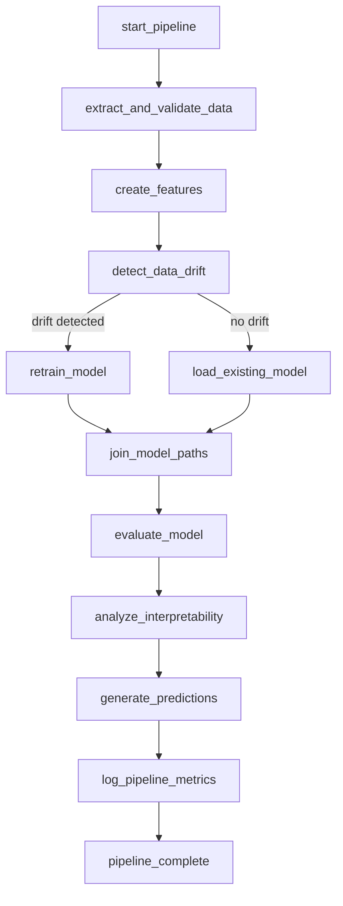

# 🚀 **Pipeline de MLOps - SodAI Drinks**

## 📊 **Descripción del DAG de Airflow**

El `sodai_recommendation_pipeline` es un pipeline completo de MLOps que implementa todo el ciclo de vida de un modelo de recomendación de productos para SodAI Drinks.

### 🔄 **Flujo del Pipeline**



### 📋 **Descripción de Tareas**

#### 1. **start_pipeline**
- **Tipo**: DummyOperator
- **Función**: Marca el inicio del pipeline
- **Dependencias**: Ninguna

#### 2. **extract_and_validate_data** 
- **Tipo**: PythonOperator
- **Script**: `scripts/data_extraction.py`
- **Función**: 
  - Carga datos de transacciones, clientes y productos
  - Valida integridad y consistencia
  - Prepara datos para feature engineering

#### 3. **create_features**
- **Tipo**: PythonOperator  
- **Script**: `scripts/feature_engineering.py`
- **Función**:
  - Genera 72 features de ML
  - Crea pares customer-product
  - Guarda dataset de entrenamiento

#### 4. **detect_data_drift** [BONUS]
- **Tipo**: PythonOperator
- **Script**: `scripts/drift_detection.py` 
- **Función**:
  - Detecta cambios estadísticos en los datos
  - Combina múltiples tests (KS, Chi-squared, etc.)
  - Toma decisión de reentrenamiento

#### 5. **retrain_model** (Condicional)
- **Tipo**: PythonOperator
- **Script**: `scripts/model_training.py`
- **Función**:
  - Optimización con Optuna (50 trials)
  - Entrenamiento con mejores hiperparámetros
  - Registro en MLflow
- **Trigger**: Solo si hay drift detectado

#### 6. **load_existing_model** (Condicional)
- **Tipo**: PythonOperator
- **Función**: Carga modelo existente si no hay drift
- **Trigger**: Solo si NO hay drift

#### 7. **join_model_paths**
- **Tipo**: DummyOperator
- **Función**: Une ambos paths (modelo nuevo/existente)

#### 8. **evaluate_model**
- **Tipo**: PythonOperator
- **Script**: `scripts/model_evaluation.py`
- **Función**:
  - Evalúa performance con métricas de recomendación
  - Calcula Precision@K, Recall@K
  - Registra métricas en MLflow

#### 9. **analyze_interpretability**
- **Tipo**: PythonOperator
- **Script**: `scripts/interpretability.py`
- **Función**:
  - Análisis SHAP de importancia de features
  - Genera explicaciones globales
  - Identifica features más influyentes

#### 10. **generate_predictions**
- **Tipo**: PythonOperator
- **Script**: `scripts/prediction_generator.py`
- **Función**:
  - Genera recomendaciones para próxima semana
  - Aplica modelo optimizado
  - Guarda predicciones para consumo de API

#### 11. **log_pipeline_metrics**
- **Tipo**: PythonOperator
- **Función**:
  - Consolida métricas de toda la ejecución
  - Registra tiempos de ejecución
  - Guarda estadísticas del pipeline

#### 12. **pipeline_complete**
- **Tipo**: DummyOperator
- **Función**: Marca completitud exitosa del pipeline

## 🔧 **Configuración del Entorno Airflow**

### **Requisitos de Python**
```txt
apache-airflow==2.8.0
pandas==2.0.3
scikit-learn==1.3.2
mlflow==2.8.1
optuna==3.4.0
shap==0.43.0
pyarrow==13.0.0
```

### **Variables de Entorno**
- `AIRFLOW_HOME=/opt/airflow`
- `PYTHONPATH=/opt/airflow/dags`
- `MLflow_TRACKING_URI=http://mlflow:5000`

### **Configuración de Conexiones**
- **PostgreSQL**: Base de datos para metadatos de Airflow
- **MLflow**: Servidor de tracking de experimentos

## 🎯 **Características Especiales**

### **Branching Condicional**
El pipeline implementa lógica inteligente que decide dinámicamente:
- **Si hay drift**: Ejecuta reentrenamiento completo
- **Si NO hay drift**: Usa modelo existente

### **Integración MLflow**
- **Tracking**: Registro automático de experimentos
- **Model Registry**: Gestión centralizada de modelos
- **Artifacts**: Almacenamiento de gráficos y métricas

### **Optimización con Optuna**
- **Hyperparameter Tuning**: 50 trials automáticos
- **Early Stopping**: Para evitar overfitting
- **Cross-validation**: Validación robusta

## 📊 **Métricas y Monitoreo**

### **Métricas del Modelo**
- **AUC-ROC**: Rendimiento general
- **Precision@K**: Precisión en top K recomendaciones  
- **Recall@K**: Cobertura en recomendaciones
- **F1-Score**: Balance precision-recall

### **Métricas del Pipeline**
- **Tiempo de ejecución**: Por tarea y total
- **Uso de memoria**: Monitoring de recursos
- **Drift Score**: Magnitud del cambio en datos
- **Model Performance**: Comparación con versiones anteriores

## 🚀 **Ejecución y Despliegue**

### **Comandos de Ejecución**
```bash
# Levantar entorno completo
docker-compose up -d

# Trigger manual del DAG
docker exec airflow-1 airflow dags trigger sodai_recommendation_pipeline

# Monitoring de tareas
docker exec airflow-1 airflow tasks list sodai_recommendation_pipeline
```

### **Acceso a Interfaces**
- **Airflow UI**: http://localhost:8080
- **MLflow UI**: http://localhost:5000
- **PostgreSQL**: localhost:5432

## ⚡ **Escalabilidad y Futuras Mejoras**

### **Preparado para Nuevos Datos**
- **Incremental Loading**: Procesamiento eficiente de datos nuevos
- **Dynamic Scheduling**: Adaptación automática de frecuencias
- **Resource Scaling**: Configuración flexible de recursos

### **Mejoras Futuras**
- **Real-time Streaming**: Integración con Kafka/Spark
- **A/B Testing**: Framework de experimentación
- **Advanced Monitoring**: Alertas proactivas
- **Multi-model Ensemble**: Combinación de modelos

---

**Autor**: SodAI Drinks MLOps Team  
**Fecha**: Noviembre 2025  
**Versión**: 1.0